# dsw1_airportproject

Este projeto é parte da disciplina ARQDSW1, ministrada pelo professor Ednilson Rossi no 2° Semestre de 2024.

## Desenvolvimento
Após feito fork do projeto inicial disponibilizado pelo professor, o desenvolvimento deste projeto foi realizado pelo aluno **João Pedro de Almeida Andolpho**.

## Tecnologias utilizadas
* Eclipse versao 2023.2
* Apache TomCat v10.1
* Bootstrap v5.3
* Java 18
* HTML5
* CSS3

Foram utilizados os padrões de projeto **Observer, State, Front Controller e MVC**.

## O projeto
Este sistema demonstra uma versão simplificada de um aeroporto, onde um administrador consegue cadastrar voos.

Um voo, neste sistema, é composto de quatro caracteristícas:
* Número;
* Companhia;
* Horário de Chegada;
* Estado.

Os estados para um voo são:
1. Arriving (Chegando);
2. Boarding (Embarcando);
3. TakingOff (Decolando);
4. TookOff (Decolado).

A progressão de estados do voo segue a sequência da lista. Quando um voo chega em seu último estado, ele é removido do sistema principal.

Para conseguir cadastrar voos, o administrador precisa se autenticar no sistema. Uma vez autenticado, ele consegue não apenas cadastrar voos, como também visualizar todos os voos cadastrados no sistema.
Ao visualizar os voos numa tabela, o administrador também consegue atualizar o estado de um voo específico ao clicar no botão "Atualizar". Quando desejar, o administrador também pode deslogar do sitema.

O sistema também conta com 4 telas que simulam totens informativos num aeroporto, que mostram informações dos voos. Existe uma tela para cada um dos estados do voo, e cada tela mostra apenas voos relevantes para aquele contexto. Por exemplo, não faria sentido exibir voos que estão chegando na tela de Embarque, e assim por diante.

Quando o administrador atualiza o estado de um voo, ele automaticamente para de ser exibido naquele totem, e passa a ser exibido no totem referente ao estado seguinte. É importante, então, esclarecer que
o totem para voos Decolados exibe apenas os **três últimos voos** a partirem. Como estes voos foram excluídos do sistema principal, não faz sentido manter eles armazenados no totem para sempre.

## Capturas do Sistema
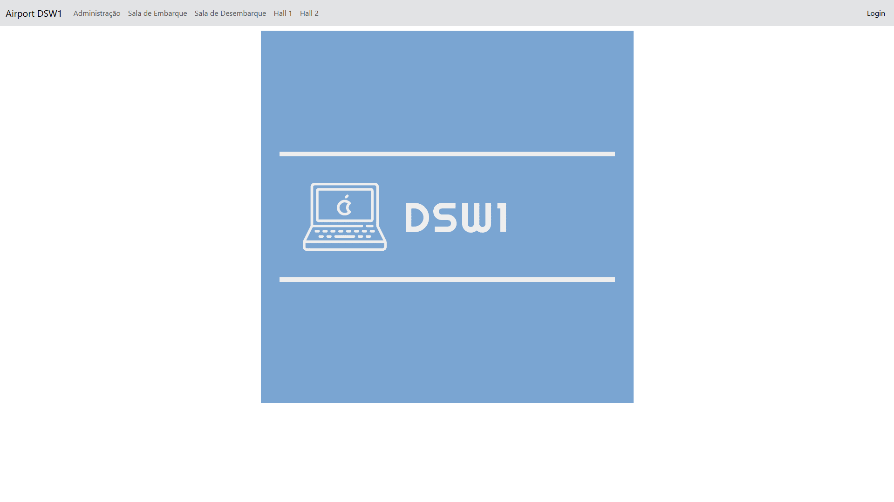
*página inicial*

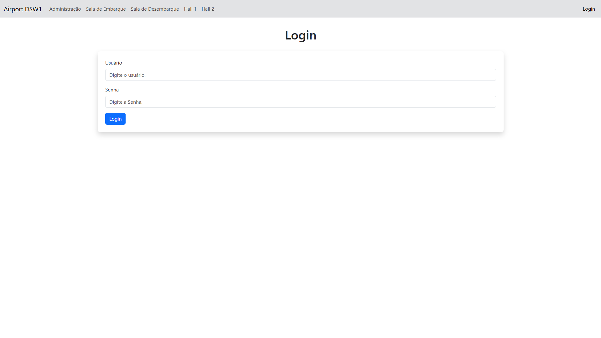
*página de login*

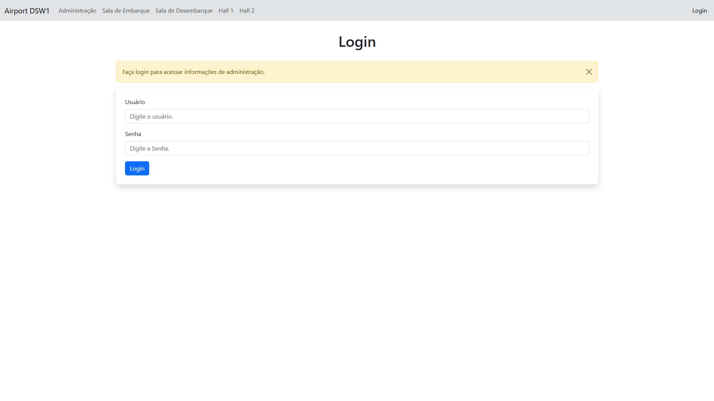
*página de login, com mensagem de aviso*

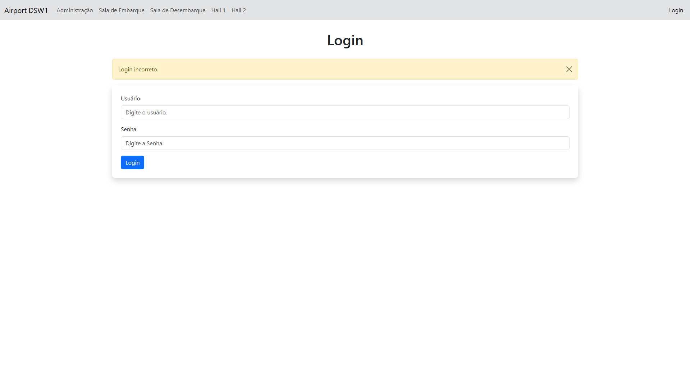
*página de login, com mensagem de credencial inválida*

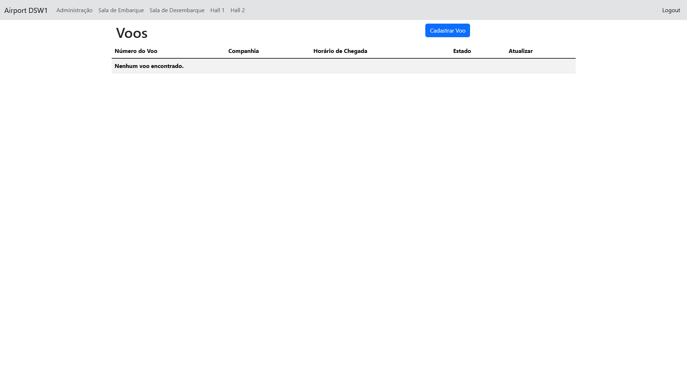
*página de administrador, sem nenhum voo cadastrado*

*página inicial, chamando atenção para o botão de logout*

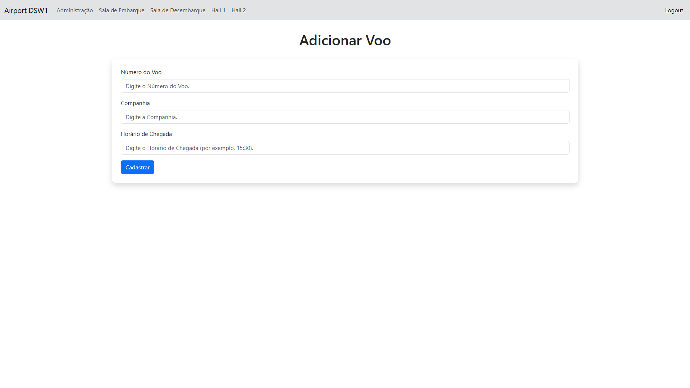
*página de cadastro de novo voo*

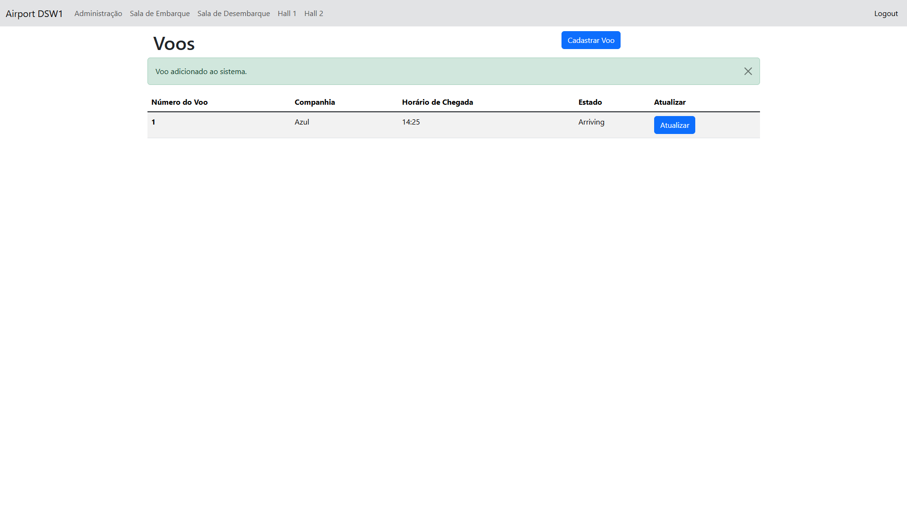
*página de administrador, com mensagem de sucesso e um voo cadastrado*

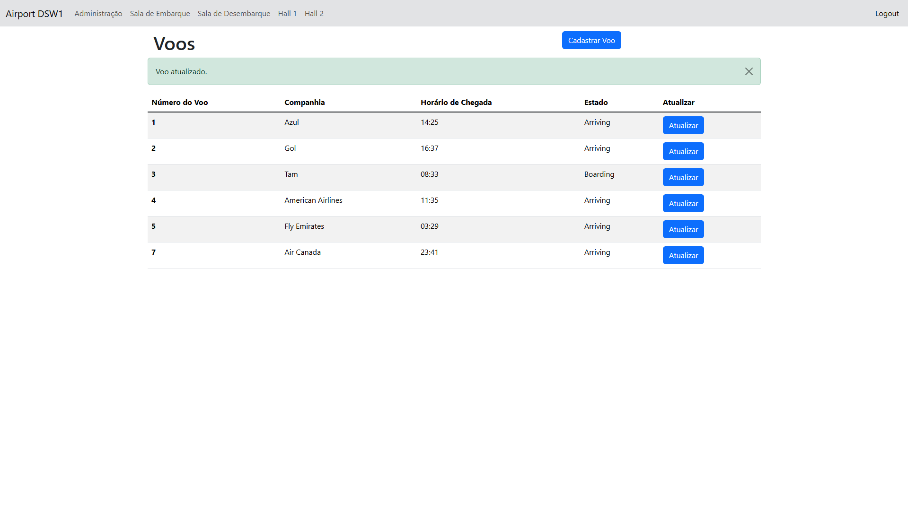
*página de administrador, com vários voos cadastrados e mensagem de sucesso na atualização*

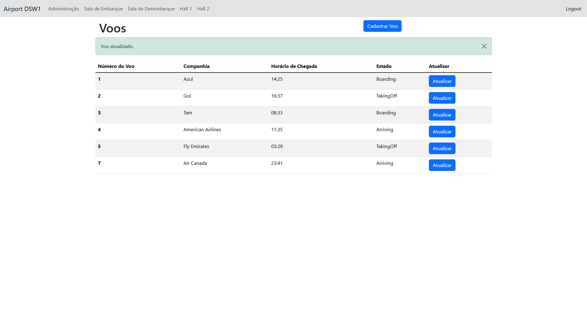
*página de administrador, com vários voos cadastrados e em estados diferentes*

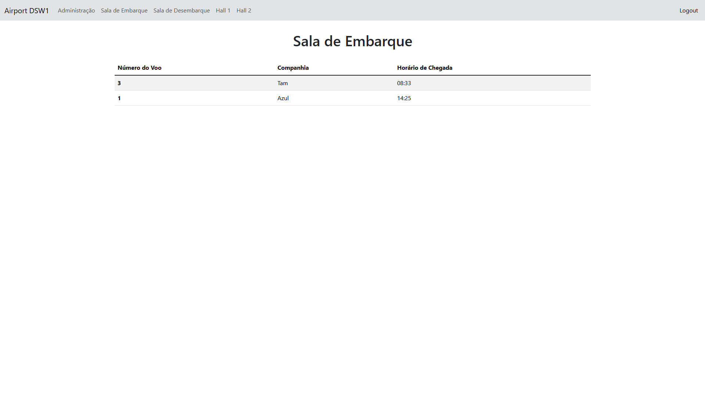
*página de embarque, mostrando os voos que estão com embarque aberto*

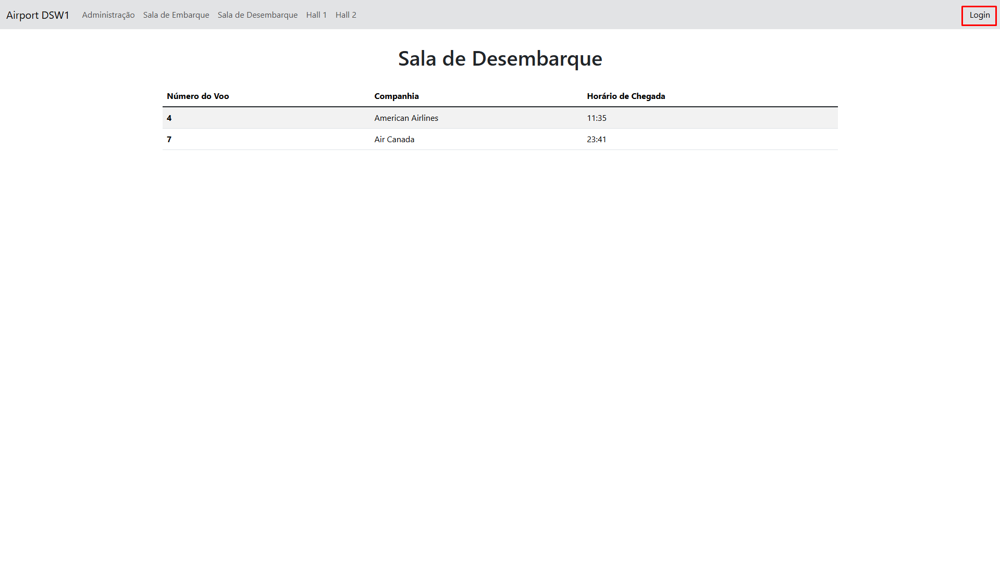
*página de desembarque, mostrando os voos que estão desembarcando com destaque que o usuário não está logado*

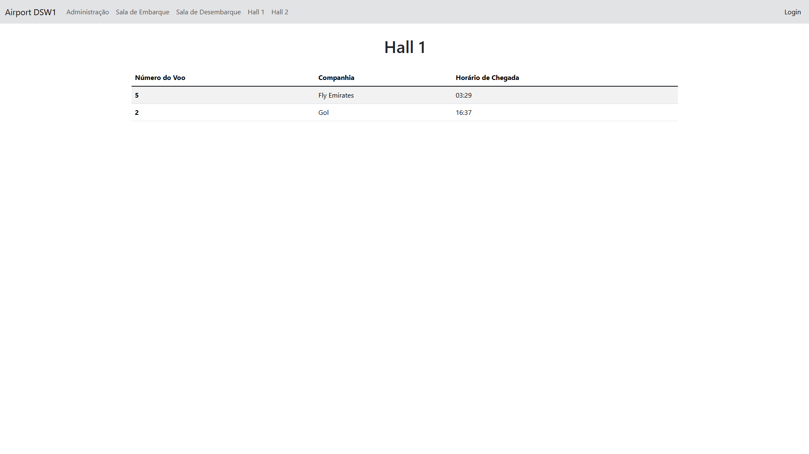
*página de hall 1, mostrando os voos que estão decolando*

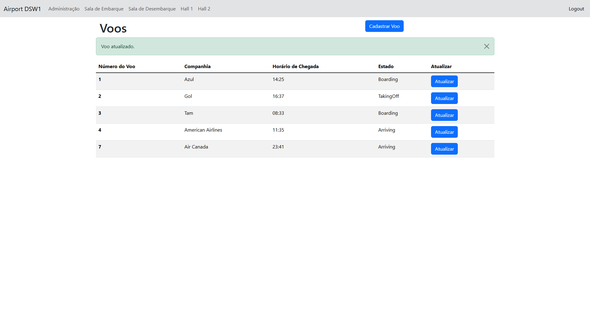
*página de administrador, com mensagem de sucesso na atualização e um voo a menos, pois ele decolou*

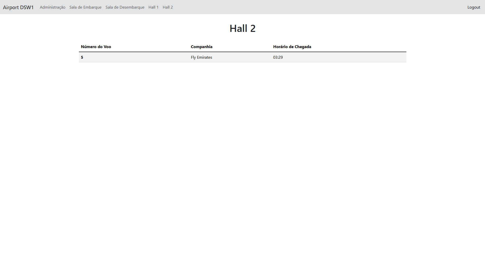
*página de hall 2, mostrando os voos que já decolaram*

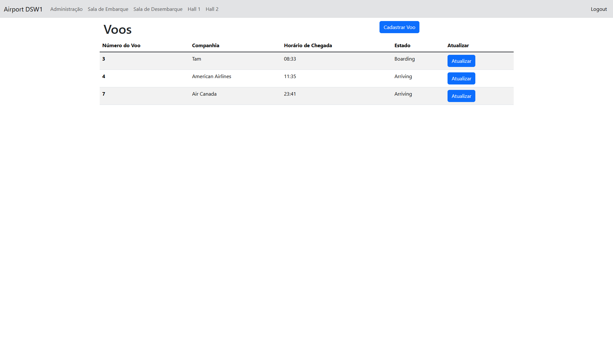
*página de administrador, agora com menos voos, pois alguns decolaram*

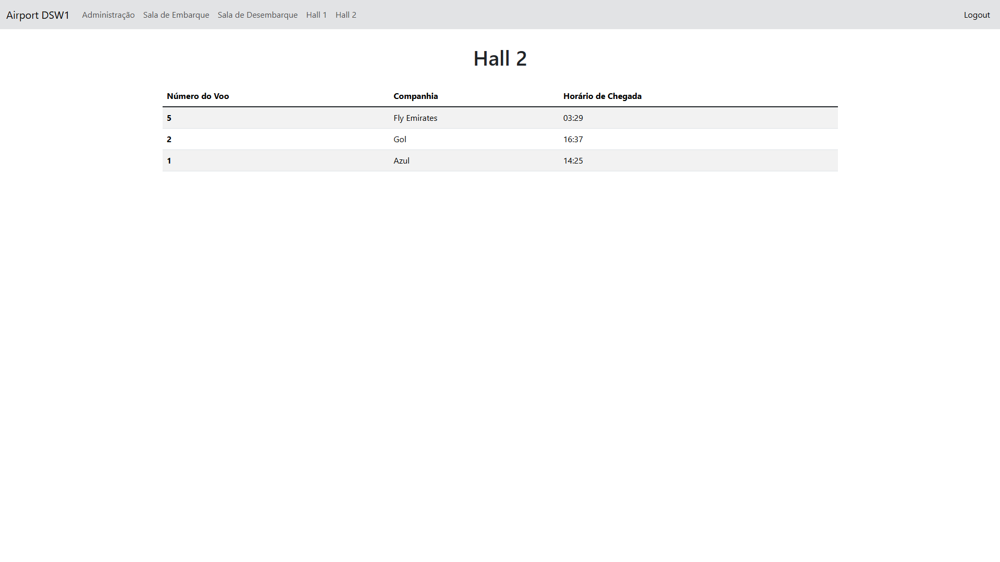
*página de hall 2, mostrando mais voos que já decolaram*

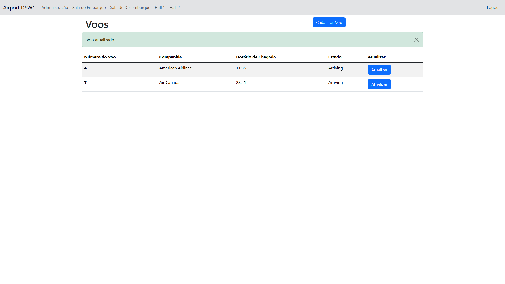
*página de administrador, agora com menos voos, mais um decolou*

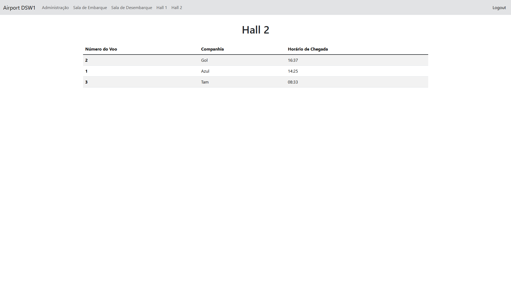
*página de hall 2, ainda mostrando três voos, agora sem o voo de numero 5*